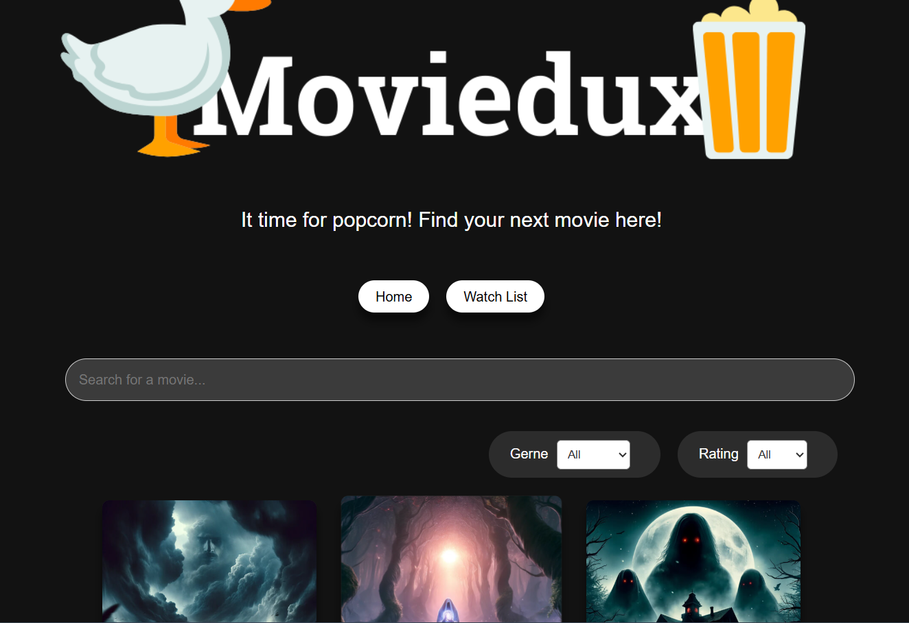

# 🎬 Moviedux

**Moviedux** is a movie streaming web application built with **React**.  
It allows users to search for movies, view detailed information, watch trailers, filter by genres, and more.

## 🚀 Features

- 🔍 **Search movies** by title
- 🎯 **Filter movies** by genre
- ⭐ **View ratings** and movie details
- 🎥 **Watch trailers** directly from YouTube
- 📱 **Responsive UI** for all screen sizes
- ⚡ High performance with **React + Vite**
- 🌐 Movie data powered by **TMDB API**

## 🛠️ Tech Stack

- **Frontend:** React, Vite,
- **API:** The Movie Database (TMDB)
- **Routing:** React Router DOM
- **HTTP Client:** Axios
- **UI & Animations:** SwiperJS (Carousel)
- **State Management:** React Hooks (useState, useEffect, useContext if needed)

## 📸 Demo Screenshot

## ⚙️ Installation & Setup

### 1. Clone the repository

git clone https://github.com/Anhthuan25022003/moviedux.git
cd moviedux

npm install

npm run dev

👨‍💻 Author
Le Si Thuan
<a href='mailto:lesithuandhkh@gmail.com'>📧 Email: thuanit@gmail.com</a>

<a href='https://github.com/Anhthuan25022003'>🌐 GitHub: Anhthuan25022003</a>

